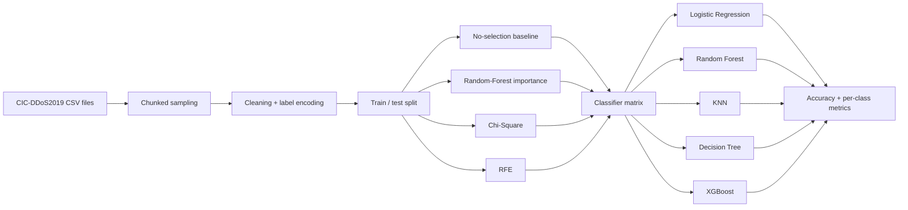

<div align="center">

# Network Intrusion Detection — Feature Selection Research

**How much does feature selection change multiclass DDoS detection performance across different machine-learning models?**


</div>

---

## Research question

> **Which feature-selection strategy preserves or improves intrusion-detection performance across different classifiers, and how does that choice affect individual DDoS attack classes?**

This project began as a learning-focused network intrusion detection study. The goal was not only to train a classifier, but to compare how **different feature-selection techniques interact with different model families** and to understand why a model that performs well overall may still perform poorly on specific attack types.

The original work was completed in Kaggle and used the **CIC-DDoS2019** dataset from the Canadian Institute for Cybersecurity at the University of New Brunswick.

---

## Project at a glance

| Research element | Historical experiment design |
| --- | --- |
| **Domain** | Cybersecurity / network intrusion detection |
| **Dataset** | CIC-DDoS2019 |
| **Task** | Multiclass classification of benign traffic and DDoS attack families |
| **Attack files used** | DNS, LDAP, MSSQL, NTP, NetBIOS, SNMP, SSDP, UDP |
| **Classes** | BENIGN + 8 DrDoS classes |
| **Historical training split** | 29,680 rows |
| **Historical test split** | 12,720 rows |
| **Initial feature space** | 87 columns before later preprocessing / feature reduction |
| **Feature selection** | No-selection baseline, Random-Forest importance, Chi-Square, RFE |
| **Models explored** | Logistic Regression, Random Forest, KNN, Decision Tree, XGBoost |
| **Evaluation** | Accuracy, per-class F1, weighted F1, precision, recall, confusion matrices |

> **Research integrity note:** the figures above come from the recovered April 2025 notebook. The full experiment has **not yet been rerun in a clean environment**, so this repository does not currently claim a final “best model” or “best feature selector.”

---

## Why feature selection?

Network-flow datasets can contain dozens of correlated, noisy, or low-value features. Feature selection can reduce the dimensionality of the problem, but the strongest subset for one classifier is not automatically the strongest subset for another.

This study compared three different ideas:

| Method | What it asks | Why it is useful here |
| --- | --- | --- |
| **Random-Forest feature importance** | Which variables contribute most to tree-based decisions? | Captures nonlinear relationships and interactions |
| **Chi-Square (`SelectKBest`)** | Which nonnegative features have the strongest statistical relationship with the class label? | Provides a simple filter-based ranking independent of a final classifier |
| **Recursive Feature Elimination (RFE)** | Which features remain most useful as a model repeatedly removes weaker variables? | Tests a wrapper-style approach tied to model behavior |

The recovered notebook experimented with multiple subset sizes, including **40-feature selection runs** and later comparisons using **20 selected features**.

---

## Experimental pipeline



The historical notebook sampled each selected attack file in chunks, retaining **300 benign records and 5,000 attack records per file** before building the train/test datasets. The experiment then encoded labels, handled missing/infinite values, scaled data where required, selected feature subsets, trained multiple classifiers, and compared performance by attack class.

---

## Why per-class F1 mattered

A single accuracy number can hide important behavior in a multiclass security problem. A model can appear strong overall while failing to recognize one or more attack families.

For that reason, the original notebook recorded a result table with:

- feature-selection method
- classifier
- attack type
- F1 score
- accuracy
- weighted F1
- precision
- recall

The recovered historical outputs already show noticeable differences in F1 performance from one attack class to another. That is why the reproduction pass will rank configurations using **both aggregate metrics and class-level performance**, rather than declaring a winner from accuracy alone.

---

## Attack classes in this experiment

```text
BENIGN
DrDoS_DNS
DrDoS_LDAP
DrDoS_MSSQL
DrDoS_NTP
DrDoS_NetBIOS
DrDoS_SNMP
DrDoS_SSDP
DrDoS_UDP
```

The complete CIC-DDoS2019 dataset contains additional attacks. This project intentionally used a subset of eight DrDoS CSV files from the dataset rather than claiming coverage of every CIC-DDoS2019 attack family.

---

## Current repository status

The original GitHub upload contained zero-byte placeholders for the notebook and generated CSV files. The actual Phase 2 notebook was later recovered from project storage and is being used to reconstruct the experiment accurately.

| Reproduction task | Status |
| --- | :---: |
| Recover original Phase 2 notebook | ✅ |
| Identify and cite the original dataset | ✅ |
| Reconstruct research question and experiment design | ✅ |
| Remove misleading zero-byte GitHub placeholders | ✅ |
| Restore a cleaned notebook to version control | ⏳ |
| Build reproducible dataset-preparation script | ⏳ |
| Pin a verified Python environment | ⏳ |
| Rerun every feature-selection × classifier configuration | ⏳ |
| Export verified comparison tables and figures | ⏳ |
| Publish final research conclusion | ⏳ |

### Historical environment note

The recovered Kaggle notebook shows an `imbalanced-learn` / scikit-learn compatibility error around the optional SMOTE import. The original experiment continued without relying on that broken import, but the reproduction pass will use a fresh, pinned environment so dependency drift does not affect the results.

---

## Repository structure

```text
.
├── README.md
├── requirements.txt
├── data/
│   └── README.md              # dataset source + reconstruction instructions
├── docs/
│   └── experiment-design.md   # detailed research methodology
├── notebooks/
│   └── README.md              # notebook recovery / cleanup status
└── results/
    └── README.md              # rules for publishing verified results
```

Large raw CIC-DDoS2019 CSV files are intentionally **not committed** to this repository. See [`data/README.md`](data/README.md) for the expected source files and setup.

---

## Reproduction plan

The next research pass will make the comparison reproducible instead of simply preserving old notebook outputs:

1. Download the official CIC-DDoS2019 source data.
2. Recreate the same eight-file sampling procedure with fixed random seeds.
3. Separate preprocessing into a deterministic pipeline.
4. Fit feature selection using **training data only** to prevent leakage.
5. Evaluate the same feature subset sizes across the same classifier matrix.
6. Save one tidy results table containing aggregate and per-class metrics.
7. Generate confusion matrices and feature-overlap visualizations.
8. Document the final answer to the research question, including tradeoffs—not only the highest score.

---

## What I wanted to learn

This project was built to strengthen both **cybersecurity** and **machine-learning** fundamentals:

- how network-flow features represent behavior during DDoS attacks
- how filter, wrapper, and embedded-style feature-selection approaches differ
- why different classifiers respond differently to the same feature subset
- how class imbalance and class-level metrics affect security-model interpretation
- why reproducibility, preprocessing boundaries, and data leakage matter in ML research

---

## Dataset citation

**CIC-DDoS2019 — Canadian Institute for Cybersecurity, University of New Brunswick**  
Official dataset: https://www.unb.ca/cic/datasets/ddos-2019.html

Dataset paper:

> Iman Sharafaldin, Arash Habibi Lashkari, Saqib Hakak, and Ali A. Ghorbani, “Developing Realistic Distributed Denial of Service (DDoS) Attack Dataset and Taxonomy,” IEEE 53rd International Carnahan Conference on Security Technology, 2019.

---

## Research status

This repository is a **research reconstruction in progress**. Historical notebook outputs are preserved as evidence of the original experiment, but final performance claims will be published only after the full pipeline has been reproduced and verified.
